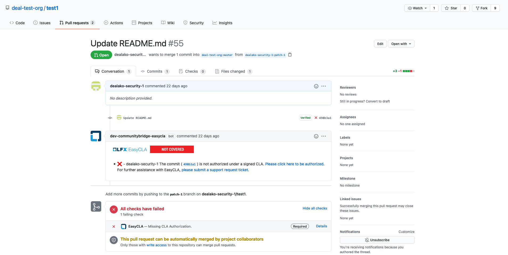
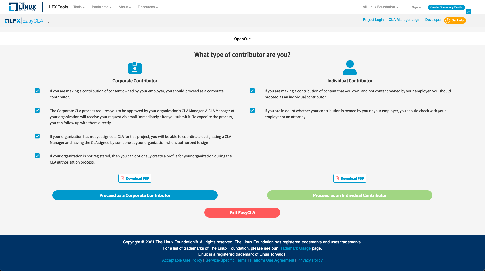
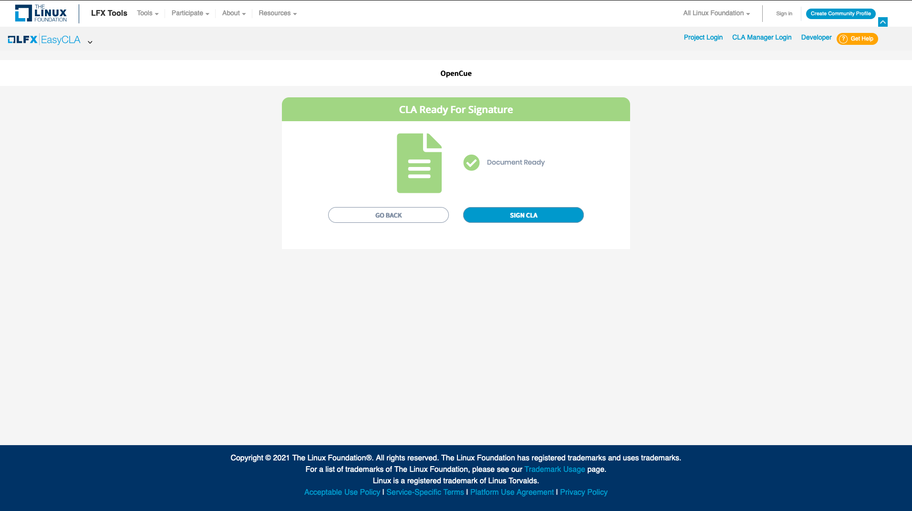
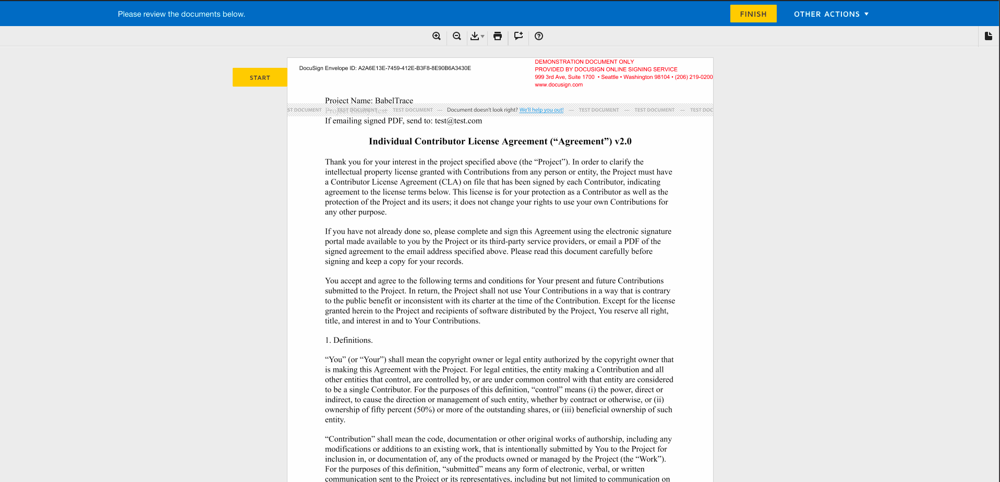
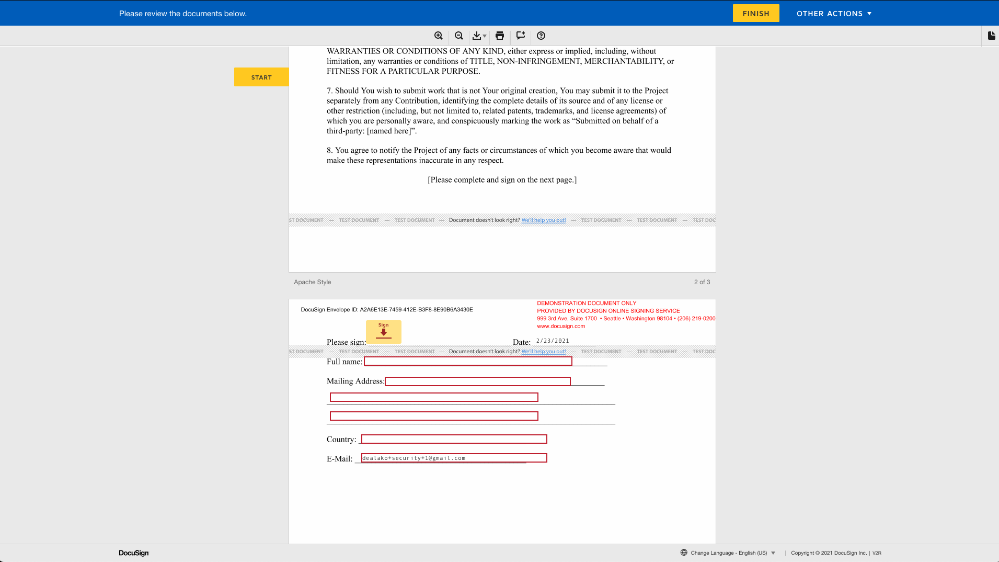
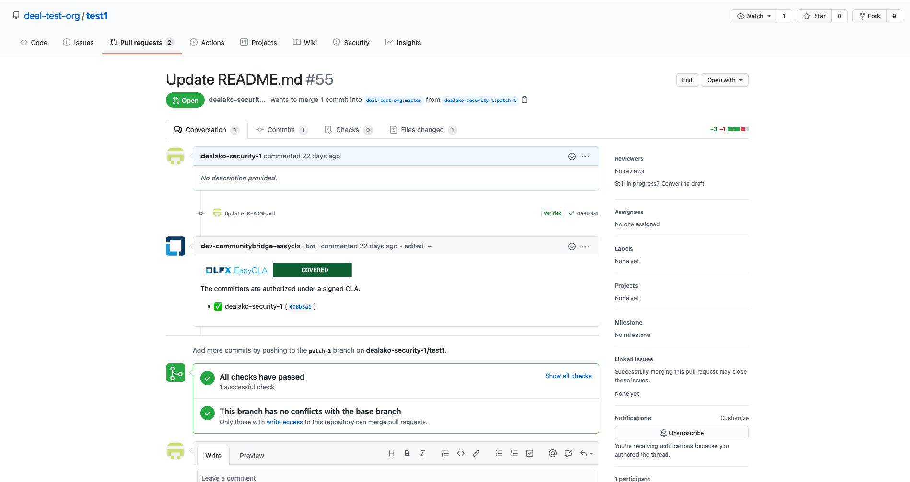

# EasyCLA Contributor Console

A stand-alone EasyCLA console for contributors to support the LFX platform.

The contributor console is accessed by a GitHub (or Gerrit) link when a pull request fails to pass the CLA
authorization.


When the user selects the authorization link on GitHub or Gerrit they are directed to the contributor console landing
page.  The user can select either the Individual Contributor or Corporate Contributor options.


If the user selected the Individual Contributor option, a new DocuSign signing request is generated.  For Corporate
Contributors users will need to first select their company from a list.  Both processes are similar.  Additional
workflows are available if the user's company is not configured in the EasyCLA system.


DocuSign CLA document header section.


DocuSign CLA document signing section.


Once the CLA is signed, the GitHub pull request status is updated.


## Documentation

Please see our [online product documentation](https://docs.linuxfoundation.org/lfx/v/v2/easycla) for a complete product
overview.

## Prerequisites
1. Make sure you have Node 12.x or higher, together with NPM 6.x or higher.
2. Install `yarn` globally on your machine.

   ```bash
   $ npm install -g yarn
   ```

3. Install `angular-cli` globally. At least we want version 13+.

   ```bash
   $ npm install -g angular-cli
   ```

## Installation

From the root of the repo just run:

```bash
$ yarn install
```

## Building

1. Run `yarn build` to build the project for your local environment.
2. The build artifacts will be stored in the `dist/` directory.
  
## Running

1. Run `yarn serve --port 8100` (You can use any port but LFX header login/logout works only on port 8100)
2. If you face any error while running the app use `export NODE_OPTIONS=--openssl-legacy-provider` command in the terminal before `yarn serve --port 8100`
3. Open new browser window/tab with this link `https://localhost:8100/`.
4. The app will automatically reload if you change any of the source files.

## Sample Local URL
`http://localhost:8100/#/cla/project/projectId/user/userId?redirect=URL

## License

Copyright The Linux Foundation and each contributor to the LFX platform.

This project’s source code is licensed under the MIT License. A copy of the license is available in LICENSE.

This project’s documentation is licensed under the Creative Commons Attribution 4.0 International License \(CC-BY-4.0\). A copy of the license is available in LICENSE-docs.

